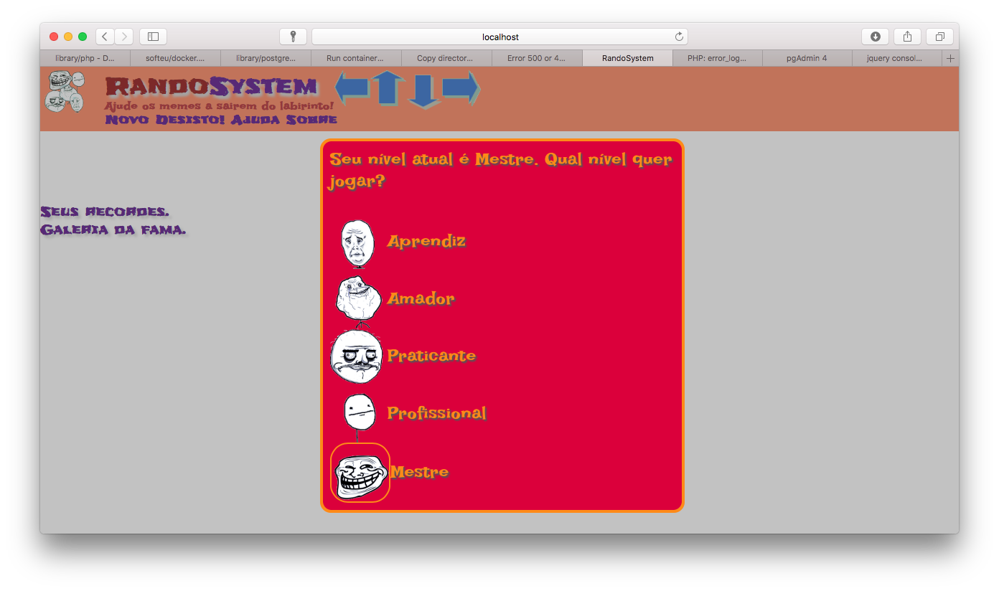
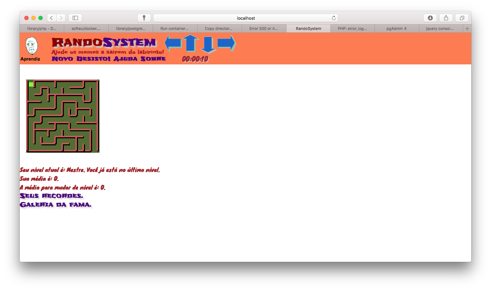
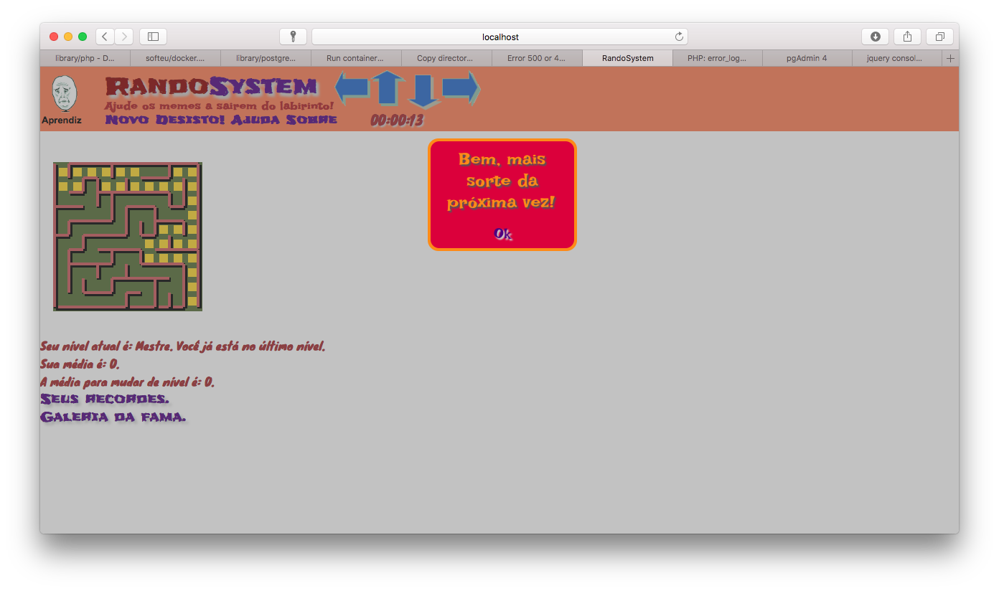
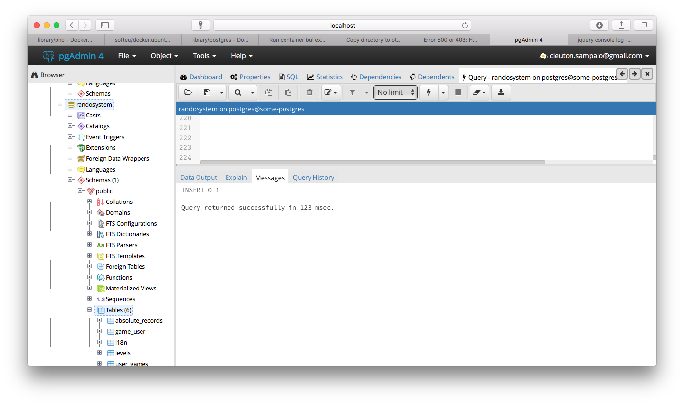

[](https://www.lcm.com.br/site/#livros/busca?term=cleuton)

# fakestartup-sample

Código de exemplo do projeto Fakestartup: Um game de labirinto, feito com PHP + PostgreSQL + Javascript/jQuery.

Este game foi parte do Curso de Pós graduação de Jogos Sociais que eu desenvolvi, e foi publicado, por um tempo no Facebook. Foi também o exercício prático do Curso de Jogos Sociais que eu desenvolvi e ministrei para várias turmas.

## Como criar um game Web

Este projeto é composto por uma parte servidora, em PHP, contendo páginas dinâmicas e RESTful services, e uma parte Cliente, em HTML5 + jQuery, que renderiza os labirintos e serve de GUI.

## O Game

Ele foi criado para ser um **Game Social** do *Facebook*, e, na verdade, funcionou lá por um tempo. Toda a autenticação era feita por OAuth 2.0 no Facebook.

O jogo usa um algoritmo de [**backtracking**](https://pt.wikipedia.org/wiki/Backtracking) para criar e resolver o labirinto. Esta parte é toda processada no PHP, e retornada através de um RESTful service, e o Javascript/jQuery apenas renderiza tudo. 

Ao entrar na página do Game, você verá a figura: 



Ao clicar no menu "novo" você deve escolher o nível que você jogará. Depois, um labirinto aparecerá para você resolver: 



Para se movimentar, clique sobre os ícones das setas, ou então use os atalhos de teclado: 

- Mão esquerda: 
  - Subir: "e"
  - Descer: "s"
  - Ir para a Esquerda: "a"
  - Ir para a Direita: "d"

- Mão direita: 
  - Subir: "i"
  - Descer: "k"
  - Ir para a Esquerda: "j"
  - Ir para a Direita: "l"


O seu tempo será registrado. Caso não consiga resolver, clique no menu "desisto" e o sistema o resolverá por você: 



## Banco de dados

O banco de dados contém a internacionalização (en / pt), os dados do Jogador e outras informações. O arquivo ["classes/DB_Manager.php"](RandoSystem/classes/DB_Manager.php) contém as configurações do banco: 

```
		$evars = array("user" => "postgres", 
						"pass" => "password",
						"host" => "some-postgres",
						"port" => "5432",
						"db" => "randosystem");

```

Para criar o banco de dados, suba o PostgreSQL e o PGAdmin. Depois, usando o menu "tools/Query Editor" do PGAdmin, copie e cole o conteúdo do arquivo ["bancoRandoSystem.sql"](bancoRandoSystem.sql) e execute a query.

# Docker

O projeto roda todo em Containers **Docker**, não havendo necessidade de instalar mais nada além do próprio [**Docker**](https://www.docker.com)

Para o PostgreSQL e o PGAdmin, há imagens prontas e, para o Apache + PHP, há um [**Dockerfile**](Dockerfile)

# Subindo o ambiente

**1) Suba o PostgreSQL**

```
docker run --name some-postgres -e POSTGRES_PASSWORD=password -d postgres
````

Você baixará uma imagem "postgres" e subirá um container com um PostgreSQL rodando. A máquina se chamará "some-postgres" e a senha do usuário "postgres" será "password".

**2) Suba o PGAdmin**

```
docker run -p 8088:80 --link some-postgres:postgres \
-e "PGADMIN_DEFAULT_EMAIL=seuemail@seuprovedor.com" \
-e "PGADMIN_DEFAULT_PASSWORD=password" \
-d dpage/pgadmin4
```

Abra um navegador e digite [http://localhost:8088](http://localhost:8088) para abrir o PGAdmin: 



Crie um Server apontando para a máquina "some-postgres" (O container dele está "linkado" ao do PGAdmin através da opção "--link", do comando "docker run"). Lembre-se de mudar o usuário para "postgres" e a senha para "password".

Clique no servidor e escolha "Create Database", criando um banco chamado "randosystem".

Selecione o novo banco de dados e use o menu "tools / query editor" para colar o conteúdo do arquivo ["bancoRandoSystem.sql"](bancoRandoSystem.sql). Execute a query.

**3) Faça build da imagem do Apache-PHP**

```
docker build -t apache-php . 
```
Após o build, crie um container com esta imagem: 

```
docker run --name apache -p 80:80 --link some-postgres:postgres -d apache-php /bin/bash /var/www/run_apache.sh
```

Pronto! Para acessar o jogo, abra um navegador e aponte para: [http://localhost](http://localhost).

## Comandos extras

**Shell** para um container: 
1. Copie o container ID com o comando "docker ps";
2. Rode o comando "docker exec -it <container ID> /bin/bash

**Parar e remover** um container: 
1. Copie o container ID com o comando "docker ps";
2. Rode o comando "docker rm --force <container ID>
 
